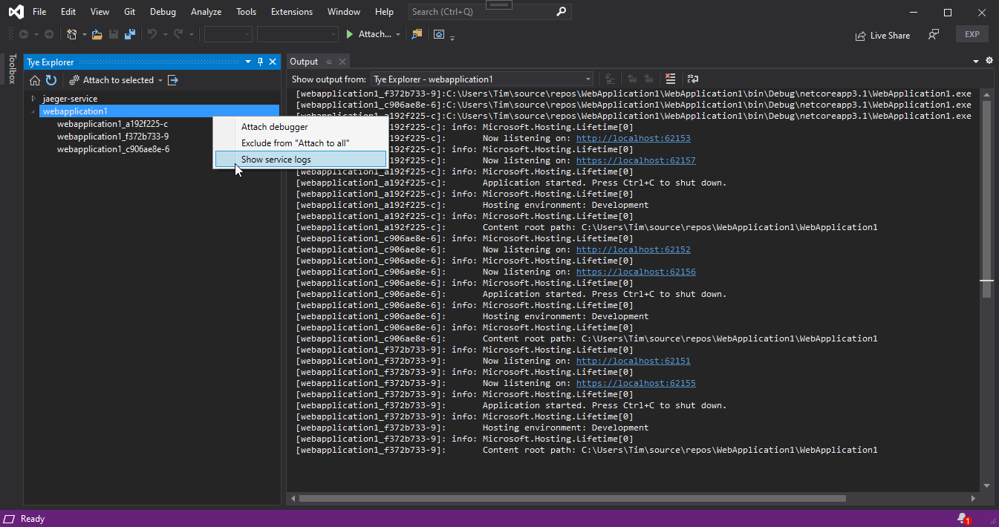

# Tye Explorer for Visual Studio

I just really wanted to easily attach a debugger to a service run by Tye. So here's a quick and simple Visual Studio extension to do so.

Feel free to open an issue for bug reports or feature requests!

## Features
- A simple overview of running services and replicas
- A shortcut to the Tye dashboard
- Show the output (logs) of a service
- Attach a debugger to:
  - a specific service
  - a specific replica
  - all running services (option to exclude specific services or replicas)
  - the startup projects of the loaded solution
 
## Installing
The extension can be found on the Visual Studio Marketplace https://marketplace.visualstudio.com/items?itemName=ikkentim.TimsTyeExplorer22 .
Install the extension through from the marketplace or directly from the extensions manager in Visual Studio.

## How to use
- Run tye from your favorite command prompt
- Open the explorer through `View -> Other Windows -> Tye Explorer`

